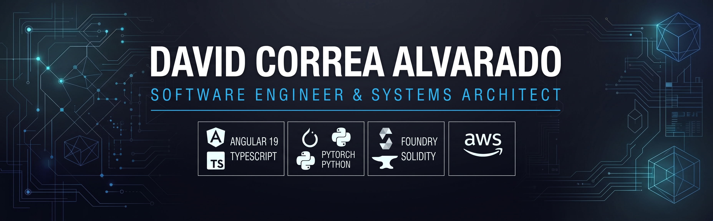

  

# 👨‍💻 David Esteban Correa Alvarado
### Software Engineer & Systems Architect | Dual Degree in CS & ADE
**Gran Canaria, Spain (UTC+0 / WEST)** · *Available for 100% Remote Roles (EU / UK / US)*

[LinkedIn](https://www.linkedin.com/in/david-correa-5140a1232/) · [Email](mailto:dalva.dev@proton.me) · [Portfolio / Repositories](#-featured-engineering-showcases)

---

## 📌 Executive Profile

Software Engineer holding a **Dual Degree in Computer Engineering and Business Administration (ADE)**, backed by foundational technical studies in **Sound Engineering (Associate Degree)** and high-pressure operational experience.

Specialized in bridging robust software engineering with business execution:
- **Resilient Web Applications:** Architectural lead for production-facing applications using Angular 19 (Signals), React, and automated CI/CD pipelines.
- **Edge AI & Audio DSP:** Engineering low-latency on-device inference pipelines (<500ms) with PyTorch, Librosa, and hardware acceleration (Apple Silicon MPS).
- **Web3 Infrastructure:** Developing auditable, tested EVM Smart Contracts with Solidity and Foundry.

> 📍 **Logistics:** Operating from the Canary Islands, Spain (UTC+0, fully aligned with London/Dublin and CET). Full EU citizenship, bilingual Spanish/English (C1, 3 years lived in the UK).

---

## 🛠️ Technical Stack & Core Competencies

| Domain | Core Technologies & Frameworks |
| :--- | :--- |
| **Backend & Systems** | Python (FastAPI, asyncio, Pydantic V2), Node.js, C++, REST APIs, PostgreSQL, SQLite, Docker |
| **Frontend & UI Resilience** | TypeScript, Angular 19 (Signals), React 18, Next.js, HTML5 Canvas API, Tailwind CSS |
| **AI, ML & Signal Processing** | PyTorch, MobileNetV3, Librosa (DSP, Mel Spectrograms), Faster-Whisper, Ollama, RAG |
| **Web3 & Smart Contracts** | Solidity, Foundry, Ethers.js, Layer-2 (Arbitrum One), EVM Architectures, Fuzz Testing |
| **Cloud & DevOps** | GitHub Actions (CI/CD), AWS (Cloud, ML Foundations, NLP), Firebase |
| **Business & Strategy** | Unit Economics, SaaS Financial Modeling (ADE), GDPR & EU AI Act Compliance Frameworks |

---

## 🏗️ Featured Engineering Showcases

### 📱 [M-Academy MVP — UI Resilience & Delivery Lead](https://github.com/dalva-code/Athens-production-architecture)
*Fullstack Developer & Technical Lead (Athens, Greece)*
- Architected the frontend-backend communication bridge for an ed-tech platform in the music industry.
- Engineered **"Bunker Mode"** utilizing Angular 19 Signals and Feature Flags, ensuring 100% UI uptime during upstream API downtime.
- Offloaded compilation to cloud runners via **GitHub Actions CI/CD**, reducing deployment cycles from 15 minutes to under 2 minutes.

### 🍼 [Edge AI Infant Cry Classifier](https://github.com/dalva-code/edge-ai-infant-cry-classifier)
*Computer Engineering Thesis Project (Grade: 8.3/10)*
- Designed an on-device bioacoustic classification pipeline using **PyTorch** and **MobileNetV3-Small** (6.2 MB disk footprint).
- Built a **Librosa DSP pipeline** (22,050 Hz sampling, Hann windowing, 128 Mel bands) achieving a **94.9% data dimensionality reduction**.
- Achieved **<480ms end-to-end inference** using Apple Silicon Metal Performance Shaders (MPS), with 85.7% accuracy on untouched analog blind tests.

### 🎙️ [Senior Voice Assistant](https://github.com/dalva-code/senior-voice-assistant)
*Accessible Ambient Voice Agent Prototype*
- Implemented an asynchronous voice messaging pipeline under strict **Hexagonal Architecture (Ports and Adapters)** with sub-1.45s latency.
- Engineered dynamic **phonetic STT biasing** in Faster-Whisper and fuzzy phonetic matching (`rapidfuzz`) to eliminate degradation on colloquial Spanish names.
- Configured local LLM intent routing with Ollama, non-blocking `aiosqlite` storage, and structured logging.

---

## 🎓 Education & Certifications

- **Dual Degree in Computer Engineering & Business Administration (ADE)** — *Universidad Isabel I (2021–2026)*
- **Higher Technical Certificate in Professional Sound Engineering** — *I.E.S. Politécnico (Grade: 7.9/10, 2012–2014)*
- **Web3 & Blockchain Master Accelerator** — *Foundry, Solidity & EVM Architecture (2025–Present)*
- **AWS Academy Accreditations:** Cloud Foundations | Machine Learning Foundations | NLP Foundations
- **Cisco Networking Academy:** Cybersecurity & Network Essentials

---

## 📬 Contact & Channels

- **LinkedIn:** [linkedin.com/in/david-correa-5140a1232](https://www.linkedin.com/in/david-correa-5140a1232/)
- **GitHub:** [github.com/dalva-code](https://github.com/dalva-code)
- **Direct Email:** [dalva.dev@proton.me](mailto:dalva.dev@proton.me)
